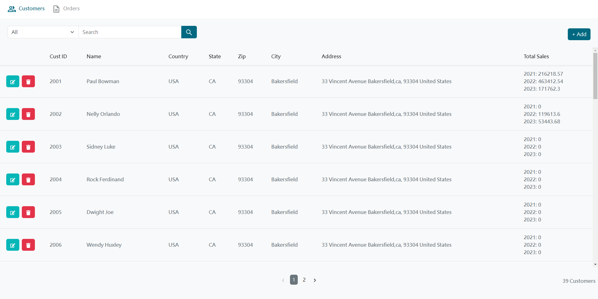

## 安裝方式

將專案 Clone 至本地端，新增資料庫並命名為 capbarbell ，匯入 sql 檔。

分別在前後端安裝 node_modules。

```
npm install
```

## 環境變數

在後端專案根目錄新增 .env 檔案，並複製 env.example 內容進行修改。

```
DB_HOST=localhost
DB_PORT=3306
DB_USER=admin
DB_PWD=
DB_NAME=capbarbell

ALLOWED_ORIGIN=http://localhost:3000
PORT=5000
```

## 啟動方式

分別在前後端啟動。

```
npm start
```

## 使用技術

- React.JS
- Bootstrap
- Sass / SCSS
- Node.JS
- Express.JS
- MySQL
